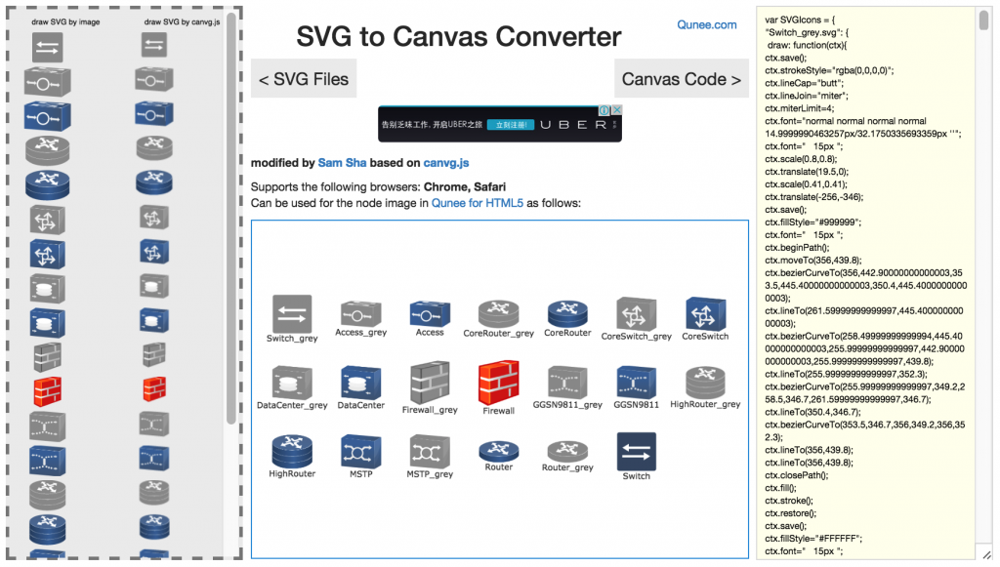

#SVG2Canvas Converter

[在线演示 - http://demo.qunee.com/svg2canvas/](http://demo.qunee.com/svg2canvas/)

#使用方式

##目录结构

src/
  --canvg-master/ -- canvg.js
  canvg2.js -- 修改生成的canvg.js
  insert.code.js -- 增加的扩展代码
  run.js -- node.js代码，使用 node run运行，生成canvg2.js
  run.sh -- 运行，生成canvg2.js
index.html -- SVG to Canvas 工具

##运行

请运行run.js或者run.sh，生成修改后的src/canvg2.js
```
cd src
node run
```
然后浏览器中访问index.html


#用途说明

[http://blog.qunee.com/2015/04/svg-to-canvas在线转换工具/](http://blog.qunee.com/2015/04/svg-to-canvas在线转换工具/)

HTML5中有两种图形解决方案：SVG和Canvas，两者都有各自特点，这里不多说，Qunee图形组件中我们常常使用SVG作为节点图标，这在大部分场景下都表现良好，但是IE下有些小问题，IE下可以将SVG图片绘制到Canvas上，但是无法读取SVG的像素信息，这意味着一些特殊功能（追踪图片边缘，图片染色等）无法被实现，这时候我们考虑选择将SVG解析，转换成Canvas的绘制代码，这样就可以使用Canvas来绘制SVG图片了


## canvg.js

是的确实有人在做这样的事，[canvg.js](https://github.com/gabelerner/canvg) 就是一个将SVG转换成Canvas的工具库，甚至有些SVG的动画效果也能得到实现，但是canvg.js存在很多问题：

### 不可避免的SVG兼容问题

SVG是一种很复杂的矢量图形语言，完全转换到Canvas相当于写一个独立的SVG查看器，即使是Adobe的SVG Viewer也会存在兼容问题，更何况一个小小的js工具库

### canvg.js无法生成Canvas绘制代码

canvg.js确实能将SVG绘制到Canvas上，但是无法生成绘制代码，就意味着需要引入这个类库，且动态解析SVG，这里存在额外的性能开销，加上canvg.js本身并不完善，代码封装性还是功能上都存在缺陷，在生产环境中引入会带来问题

###  professorcloud

网上搜索svg to canvas，可以找到这个：[http://www.professorcloud.com/svg-to-canvas/ ](http://www.professorcloud.com/svg-to-canvas/)可以将SVG转换成Canvas，并输出javascript代码，符合制作矢量图标的需要，Qunee早期的内置icon都是这样制作的，但是这个工具并不完善，不支持渐变，不支持纹理，大部分的SVG图标无法转换，于是我们考虑自己写一个在线工具，以方便客户使用，我们查看了http://www.professorcloud.com/svg-to-canvas/ 的代码，它是在某个老版本的canvg.js基础上修改实现的，是写死的代码，不方便后期升级和维护，我们想到一种更好的方式来实现

## SVG2Canvas

我们想到一种更好的方式实现SVG到Canvas代码的转换，在线地址：[http://demo.qunee.com/svg2canvas/](http://demo.qunee.com/svg2canvas/)

### 实现思路

通过重写HTMLCanvasElement相关的方法来实现，基本的思路就是将CanvasRenderingContext2D.prototype中的相关绘制和设置代码重写，增加上生产js代码的功能，比如对CanvasRenderingContext2D#fill()方法的处理，我们可能要重写这个方法
<pre class="prettyprint">CanvasRenderingContext2D.prototype.fill2 = function(){
   this.fill();
   appendCode('ctx.fill();\n');//生成js代码
}</pre>
当然实际上要比这复杂，需要考虑如何重写方法？如何将参数对象转换成字符串？此外对于复杂的SVG，可能会需要创建临时的Canvas对象，还涉及到一些正则表达式，还要注意作用域的问题，花费了些功夫，实现了一套不错的工具，基本上canvg.js能支持的svg，都能很好的转换，支持Gradient, 支持Pattern等

### 在线服务

好的东西如果只是自己使用，未免太浪费了，于是我们又花了不少时间将其做出了一个好的界面，并公布出来

在线地址：[http://demo.qunee.com/svg2canvas/](http://demo.qunee.com/svg2canvas/)

支持Chrome, Safari浏览器，左中右布局分布，将svg文件拖拽到左侧虚线框中，即可生成Qunee for HTML5中相应的图片注册代码，并及时预览到图片在Qunee for HTML5中的展示效果，如下：


### 使用生成的代码

将右侧文本框中的代码保存到js文件（比如SVGIcons.js），并在HTML中引入这个js，之后你就可以直接使用svg文件名作为节点图标了
<pre class="prettyprint">node.image = 'DataCenter.svg';
</pre>
示例代码
<pre class="prettyprint">&lt;!DOCTYPE html&gt;
&lt;html&gt;
&lt;head&gt;
&lt;title&gt;Hello Qunee for HTML5&lt;/title&gt;
&lt;meta charset="utf-8"&gt;
&lt;/head&gt;
&lt;body style="margin: 0px"&gt;
&lt;div style="position: absolute; width: 100%; top: 0px; bottom: 0px;" id="canvas"&gt;&lt;/div&gt;
&lt;script src="http://demo.qunee.com/lib/qunee-min.js"&gt;&lt;/script&gt;
&lt;script src="SVGIcons.js"&gt;&lt;/script&gt;
&lt;script&gt;
var graph = new Q.Graph('canvas');

var node = graph.createNode("SVG");
node.image = 'DataCenter.svg';

&lt;/script&gt;
&lt;/body&gt;
&lt;/html&gt;
</pre>
**运行效果**

